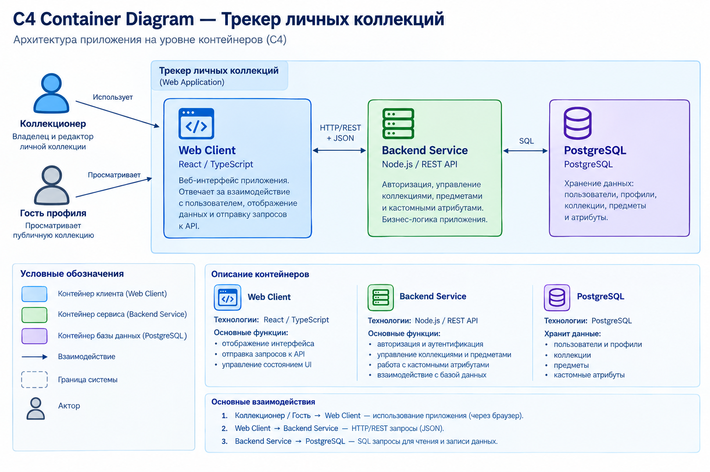
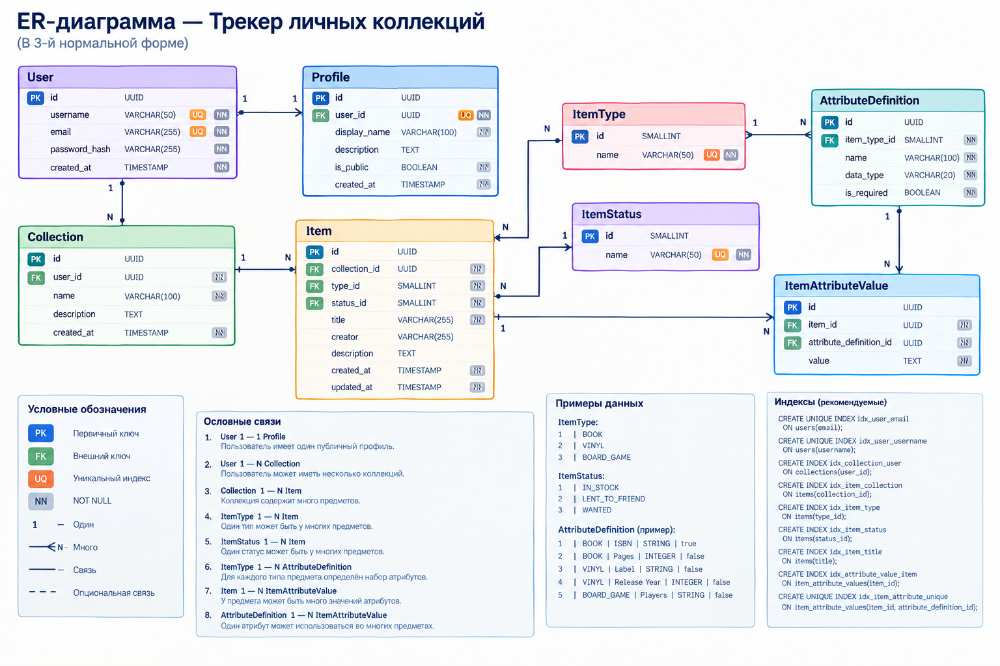

# Трекер личных коллекций

Веб-приложение для ведения и просмотра личных коллекций книг, виниловых пластинок и настольных игр.

## Возможности

- регистрация и авторизация пользователей;
- создание и редактирование личных коллекций;
- добавление книг, виниловых пластинок и настольных игр;
- изменение и удаление предметов;
- статусы предметов:
  - `В наличии`;
  - `Отдал другу`;
  - `В желаемом`;
- кастомные атрибуты предметов;
- поиск и фильтрация предметов;
- публичные профили коллекционеров;
- просмотр публичных коллекций гостями.

## Роли пользователей

### Коллекционер

Владелец коллекции. Может создавать коллекции, добавлять и редактировать предметы, изменять статусы и кастомные атрибуты, а также управлять публичностью профиля.

### Гость профиля

Пользователь, который просматривает публичный профиль коллекционера и доступные ему предметы коллекции. Изменять данные гостю запрещено.

## Архитектура

Приложение состоит из трёх основных контейнеров:

- **Web Client** — веб-интерфейс на React / TypeScript;
- **Backend Service** — REST API и бизнес-логика на Node.js;
- **PostgreSQL** — реляционная база данных.

Подробное архитектурное описание, Use Cases, C4 Container Diagram и ER-диаграмма находятся в [ARCHITECTURE.md](ARCHITECTURE.md).

## Диаграммы

### C4 Container



### ER Diagram



## Предполагаемый стек

- React;
- TypeScript;
- Node.js;
- REST API;
- PostgreSQL;
- Docker.

## Структура репозитория

```text
collection-tracker/
├── README.md
├── ARCHITECTURE.md
├── docs/
│   └── diagrams/
│       ├── c4-container.png
│       └── er-diagram.png
├── client/
├── server/
└── docker-compose.yml
```

## Назначение проекта

Проект предназначен для хранения и управления информацией о личных коллекциях пользователя с возможностью публичного просмотра выбранных коллекций.
